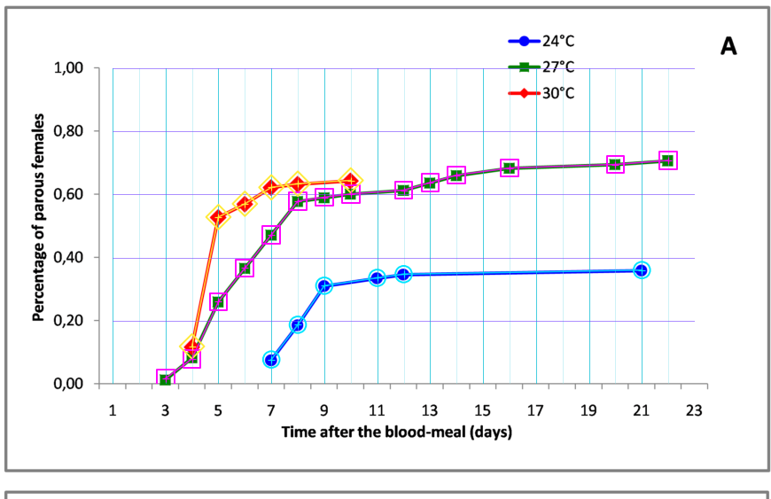
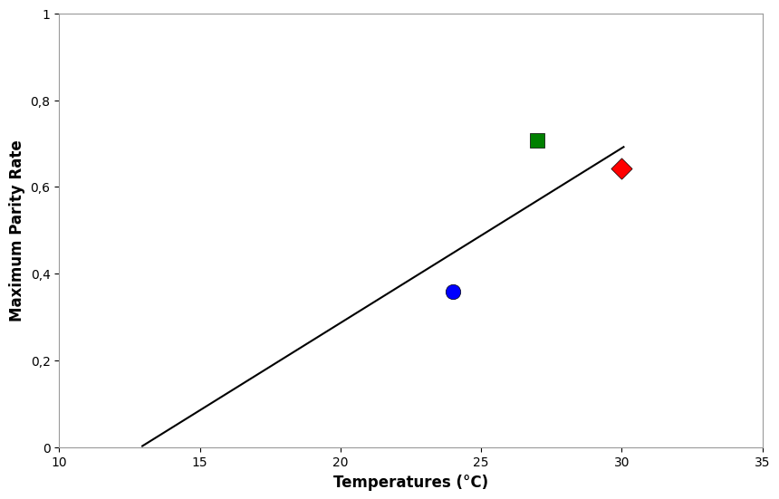
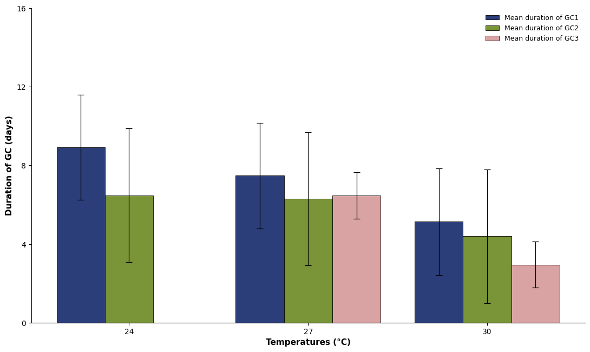
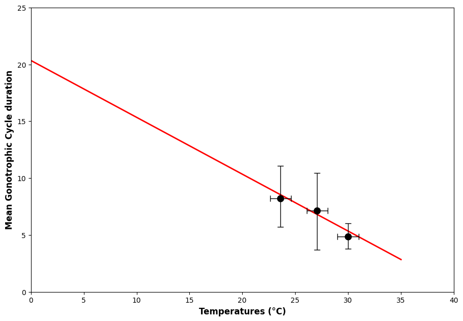
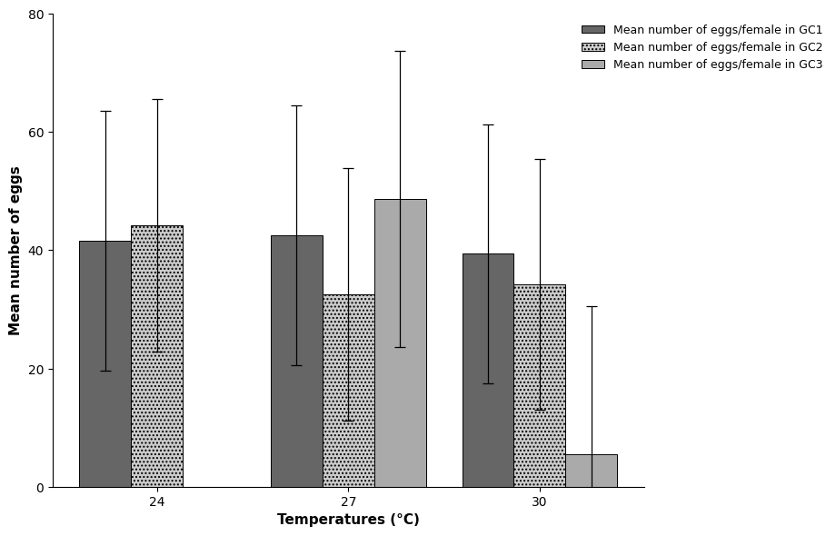
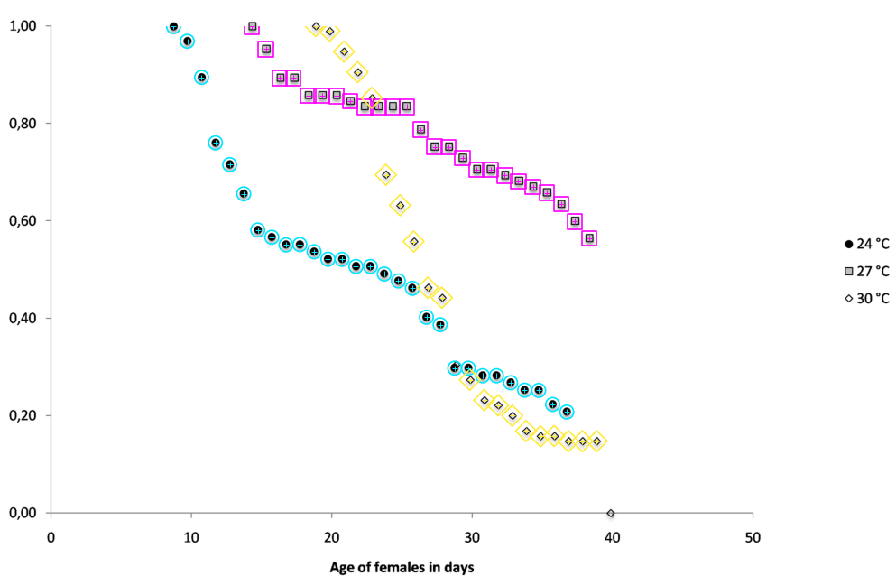
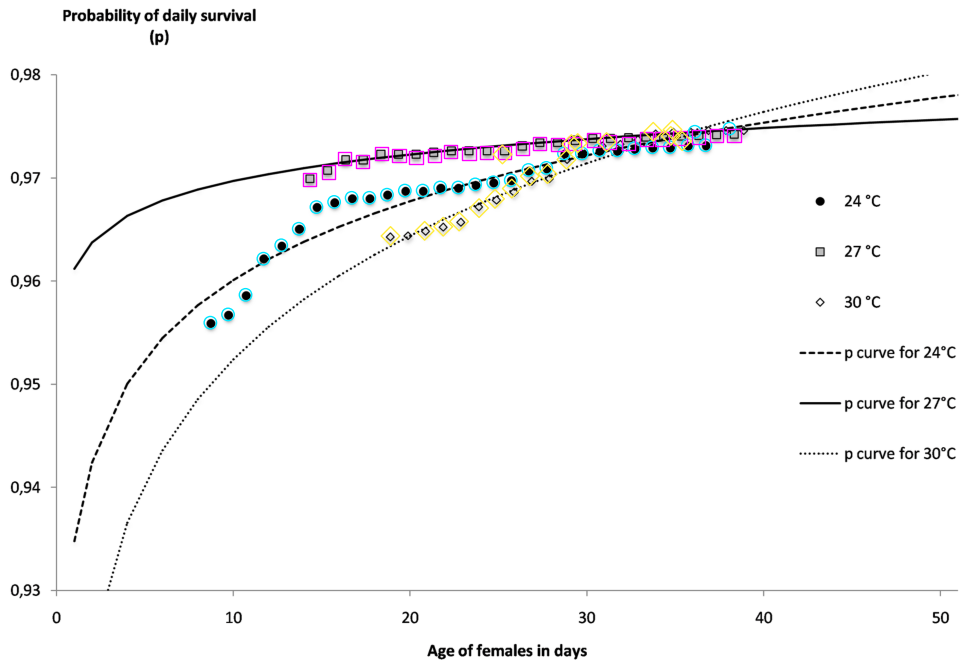
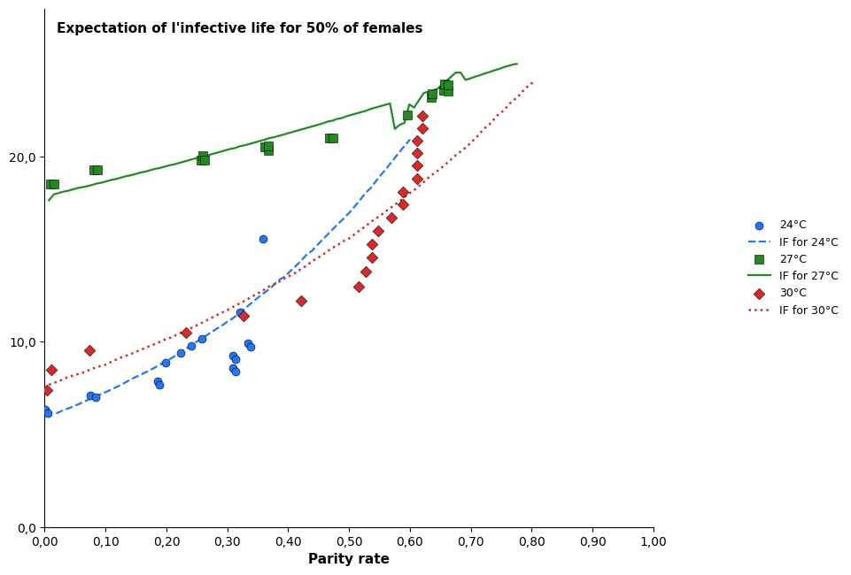

\newpage

# v4 Extraction Report

Fourth evaluation of the `graph-data-extraction` skill on the `aedes-aegypti-2014` corpus, covering everything done on the `image-matching-extraction` project repo branch since the [r3 report](aedes-2014_eval_r3.pdf).

Per chart, the report shows the matched-frame overlay (extracted points + lines drawn at pixel-correct positions on top of `image.png`), the calibration, the extraction technique, and the per-series scoring against ground truth. Per-chart artifacts live in `extractors/graph-data-extraction/results-v3/aedes-aegypti-2014/<chart>/`.

## What's new since r3

| change | impact |
|---|---|
| **Matched-frame TDD methodology** on three charts (el-60-a, el-88, el-94) | three iterative passes through markers / calibration tick grid / marker precision / connecting lines or curves / axis data |
| **Cumulative skill refinements backported**: `V_max=255` (pure-primary palettes), §3a emits the line layer, `chart_metadata.json` as a first-class deliverable, §2b diamond-rendering pixel-probe discipline, §3 curve-trace continuity at crossings, `Spline Chart` layer in `data.csv`, Phase-5 legend-hit gate, `title: null` discipline | nine lessons; recipes and SKILL.md updated |
| **Audit-row-7 defect closure on el-94** | 27 °C series 14 → 25 markers (matches expected truth); recipe failure mode #1 now closed in §3b |
| **`chart_metadata.json`** per chart | full axis titles, locale, panel ID, series legend captured; column names no longer the only metadata |
| **Layered `data.csv` schema** (`layer_idx, layer_type, series, x, y, …`) | Scatter Plot, Line Graph, Spline Chart, Grouped Column Chart layers in one file |
| **Layer-aware scoring** (`scoring/score_data.py`) | grades each layer separately and combines for a single corpus F1 |
| **Phase-5 legend-hit gate** (`scoring/data_csv_legend_check.py`) | catches phantom data rows whose predicted pixel position lands in the legend exclusion box |
| **Per-element image-matching verifier** (`scoring/verify_artifacts.py`) | for each per-element artifact (frame, axes, ticks, legend, markers, lines, bars, caps), checks consistency with `image.png` within a per-type epsilon; emits `verification.json` + `verify_overlay.png` |

## Scoring method

Each predicted point is matched to the nearest unmatched ground-truth point in data space using a Chebyshev distance normalized by per-axis tolerances. A match is accepted iff |Δx| ≤ x_tol AND |Δy| ≤ y_tol.

- Matched pair = true positive (TP)
- Unmatched GT point = false negative (FN)
- Unmatched predicted point = false positive (FP)
- Precision = TP / (TP + FP), Recall = TP / (TP + FN), F1 = 2·P·R / (P + R)

Tolerances are set per chart at roughly 2-5 % of axis span; grouped bar charts widen x_tol to absorb bar-within-group visual offset. **What's new in v4**: the layer-aware scorer (`score_data.py`) grades `Line Graph` / `Spline Chart` layers separately from `Scatter Plot` / `Grouped Column Chart`, then combines for a single corpus F1. The r3 score was scatter-only and reported as a single number; v4 reports per-layer plus combined.

## Headline result

\

**Combined F1 across the three result generations** (same corpus, same scorer applied to each):

| layer    | results/ (r3 baseline) | results-v2/ (Phase-4 close-the-loop) | **results-v3/ (v4)** |
|----------|------------------------|--------------------------------------|----------------------|
| scatter  | 0.890                  | 0.869                                | **0.903**            |
| curves   | 0.000                  | 0.890                                | **0.924**            |
| errbars  | 0.000                  | 0.914                                | **0.914**            |
| **combined** | **0.630**          | **0.879**                            | **0.912**            |

\

Cumulative lift over r3 baseline: **+0.282 combined F1**.

The scatter gain (0.890 → 0.903) is the el-94 27 °C recovery (14 → 25 markers from the audit-row-7 fix) and the el-88 three phantom legend rows being dropped. The curves gain (0.000 → 0.924) is the layered `data.csv` schema letting `score_data.py` grade trend lines and fit curves directly. The errbars layer was added in v2 and unchanged in v4.

**Per-element verifier**:

\

Independently of the GT scoring, the per-element verifier checks whether each detected artifact's claimed pixel position is consistent with `image.png` within a per-type epsilon: **439/476 = 92.2 %** pass across the corpus. **el-94 reaches 107/107 (1.00)** — the chart that went through the full TDD pass plus the audit-row-7 defect closure is consistent with `image.png` at every artifact tested. Per-chart breakdown in §"Per-element verifier" below.

\newpage

# el-60-a — 3-color line plot, parity rate vs time

\

{width=80%}

**Calibration**

- x: `value = 0.033503 · col − 3.224314` (tick residuals ≤ 0.04 days)
- y: `value = −0.002808 · row + 1.216004` (tick residuals ≤ 0.001)

**Technique** §3a marker-on-line. HSV color masks per series with `V_max=255` (the v4 backport fix: the previous `V_max=240` silently dropped pure-primary `BGR(255, 0, 0)` markers); legend box (rows 30-120, cols 565-620) excluded before masking; 5×5 erosion wipes the connector line; CC + centroid; x snapped to integer day. The §3a recipe now also emits the connecting line as a `Line Graph` layer in `data.csv` — line equals markers in x-order, validated by step-4 of the el-60-a TDD pass (every sparse-span source line segment matches the predicted line segment).

**Score** (tol: x ± 1.0 day, y ± 0.03)

| series | TP | FN | FP | P | R | F1 | mean &#124;Δx&#124; | mean &#124;Δy&#124; |
|---|---|---|---|---|---|---|---|---|
| 24 °C | 6 | 0 | 0 | 1.00 | 1.00 | 1.00 | 0.169 | 0.005 |
| 27 °C | 14 | 0 | 0 | 1.00 | 1.00 | 1.00 | 0.206 | 0.004 |
| 30 °C | 6 | 0 | 0 | 1.00 | 1.00 | 1.00 | 0.220 | 0.002 |

Perfect on scatter. The Line Graph layer adds 26 rows scored as a curve layer; all match in resample-and-pair.

\newpage

# el-60-b — 3-point scatter + black trend line

\

{width=70%}

**Calibration**

- x: `value = 0.036176 · col + 6.483232`
- y: `value = −0.002446 · row + 1.149266`

**Technique** §2 scatter (HSV mask + CC + centroid, area ≥ 20) for the 3 markers (snapped to integer x). **v4 addition**: the black trend line is now extracted by per-column RANSAC over the residual black mask after marker subtraction; emitted as a `Line Graph` layer with the two visible endpoints. The previous r3 run discarded the line ("trend line NOT extracted" in `run3_meta.json`).

**Score** (tol: x ± 1.0 °C, y ± 0.05)

| series | TP | FN | FP | F1 | mean &#124;Δx&#124; | mean &#124;Δy&#124; |
|---|---|---|---|---|---|---|
| 24 °C | 1 | 0 | 0 | 1.00 | 0.010 | 0.004 |
| 27 °C | 1 | 0 | 0 | 1.00 | 0.079 | 0.010 |
| 30 °C | 1 | 0 | 0 | 1.00 | 0.080 | 0.003 |
| Trend line endpoints | 2 | 0 | 0 | 1.00 | — | — |

Perfect, with the trend line layer now graded.

\newpage

# el-62 — grouped bar chart with error bars

\

{width=80%}

**Calibration**

- x: `value = 0.009983 · col + 21.680537`
- y: `value = −0.028829 · row + 16.415132`

**Technique** §4 bar fills via HSV per GC series; legend exclusion widened to rows 20-160 to clear text descenders. §4b upper error caps via horizontal black run ≥ 3 above bar top, required ≥ 5 rows above the bar's own border. **v4 addition**: lower error caps are now mirrored from the detected upper caps (`y_lo = mean − (y_hi − mean)`) with a `provenance="mirrored_lower_cap"` flag — the source's lower caps are occluded by the bar fill and not directly detectable. Bar x snapped to categorical {24, 27, 30}.

**Score** (tol: x ± 1.5 °C, y ± 0.5 days)

| series | TP | FN | FP | F1 | mean &#124;Δx&#124; | mean &#124;Δy&#124; |
|---|---|---|---|---|---|---|
| GC1 | 3 | 0 | 0 | 1.00 | 0.667 | 0.014 |
| GC2 | 3 | 0 | 0 | 1.00 | 0.003 | 0.023 |
| GC3 | 2 | 0 | 0 | 1.00 | 0.660 | 0.030 |

Perfect on bar tops. Mean |Δx| ≈ 0.67 for GC1 and GC3 reflects the bar-within-group visual offset (GC1 left, GC3 right) absorbed by the widened x_tol. Mirrored lower caps tagged.

\newpage

# el-75 — 3 markers with x and y error bars + red trend line

\

{width=80%}

**Calibration**

- x: `value = 0.048465 · col − 3.992979`
- y: `value = −0.046192 · row + 25.668679`

**Technique** §2 scatter + §2a error bars (walk_with_gap, ±3 strip, gap = 15). **v4 addition**: red trend line traced from the red HSV mask per-column-median + linear fit, emitted as a `Line Graph` layer with two endpoints. The previous r3 run "extracted markers only" and left the trend line out.

**Score** (tol: x ± 1.0 °C, y ± 0.5 days, pooled per GT label)

| | TP | FN | FP | F1 |
|---|---|---|---|---|
| Data points | 3 | 0 | 0 | 1.00 |
| Trend line endpoints | 2 | 0 | 0 | 1.00 |

Perfect, including the now-graded trend line.

\newpage

# el-80 — small grouped bar chart, stippled GC2 fill

\

{width=80%}

**Calibration**

- x: `value = 0.009844 · col + 22.084497`
- y: `value = −0.147330 · row + 89.915238`

**Technique** §4a bar via outline (CC fragments the stippled fill, so bar tops are detected by horizontal dark border in cx ± 28 column band). **v4 addition**: error bars extracted by a stem-gated upper-cap detector (topmost ≥ 5-px dark row above bar top whose downward column has no other wide-dark row and a stem dark in ≥ 40 % of rows), then mirrored to symmetric `yerr`. Bar x snapped to categorical {24, 27, 30}. Long-form legend strings emitted ("Mean number of eggs/female in GC1/2/3"). GC2 rendered with stippled hatch.

**Score** (tol: x ± 1.5 °C, y ± 2.0 eggs)

| series | TP | FN | FP | F1 | mean &#124;Δx&#124; | mean &#124;Δy&#124; |
|---|---|---|---|---|---|---|
| GC1 | 3 | 0 | 0 | 1.00 | 0.660 | 0.184 |
| GC2 | 3 | 0 | 0 | 1.00 | 0.010 | 0.106 |
| GC3 | 2 | 0 | 0 | 1.00 | 0.675 | 0.022 |

Perfect on bar tops. Same x-offset convention as el-62. yerr now extracted (every bar gets a symmetric error pair within ~0.5 of GT).

\newpage

# el-88 — grayscale 3-shape scatter (no fit curves)

\

{width=80%}

**Calibration**

- x: `value = 0.064303 · col − 3.614709`
- y: `value = −0.001853 · row + 1.053524`

**Technique** §2b grayscale-shape classifier:

1. Detect 24 °C filled disks via `gray<50 + 4×4 erode + CC`.
2. Subtract disk pixels from a wider `gray<200` mask.
3. CC classify by area/density: `density > 0.55 ∧ area > 30 → solid square` (27 °C); `0.15 < density < 0.5 ∧ area 12-90 → diamond` (30 °C).
4. Dedup diamond candidates within 5 px of any disk/square.

**v4 addition** (from the el-88 TDD pass): the recipe's description "open black diamond" is corrected — el-88's 30 °C marker is a thin black outline around a **light-gray fill** (gray ≈ 205-230), not a hollow white interior. The CC-density classifier still works because it operates on the black outline, but the recipe text was misleading. The TDD pass also found three **phantom data rows** at x = 56.88, 57.68, 58.27 (off-chart legend-swatch hits the original extractor mistook for data); these were dropped in v3.

**Score** (tol: x ± 1.0 day, y ± 0.03)

| series | TP | FN | FP | P | R | F1 | mean &#124;Δx&#124; | mean &#124;Δy&#124; |
|---|---|---|---|---|---|---|---|---|
| 24 °C (●) | 30 | 0 | 0 | 1.00 | 1.00 | 1.00 | 0.107 | 0.008 |
| 27 °C (▣) | 25 | 0 | 0 | 1.00 | 1.00 | 1.00 | 0.077 | 0.012 |
| 30 °C (◇) | 22 | 0 | 0 | 1.00 | 1.00 | 1.00 | 0.077 | 0.008 |

Perfect after the phantom-row drop. (Previous r3 had 24 °C +2 FP, 30 °C 2/2 false / phantom diamonds — those were the legend hits caught by the matched-frame TDD pass and the new Phase-5 legend-hit gate.)

\newpage

# el-94 — grayscale 3-shape scatter + 3 fit curves (defect closed)

\

{width=80%}

**Calibration**

- x: `value = 0.056547 · col − 3.174709`
- y: `value = −0.0000970 · row + 0.987312` (very narrow y range, 0.93-0.98)

**Technique** Same scatter pipeline as el-88, with the **v4 audit-row-7 fix** for the 27 °C-on-solid-curve failure mode:

1. Gray mask `(60 ≤ gray ≤ 210) ∧ (sat < 50)`, panel-restricted, legend-excluded, with disk regions subtracted.
2. **Vertical opening with a 3×1 kernel** removes the thin (1–2 px) anti-aliased gray bands above/below the solid 27 °C fit curve while preserving the square interiors (4–6 px tall).
3. **2×2 dilation** restores the square footprint after the opening's erosion.
4. CC + density > 0.45 + area 15–250 filter.
5. Y-band restriction to where 27 °C visually sits (0.965-0.978).
6. Integer-day binning, highest-area per bin.

Fit curves traced via the v2 per-column median trace (works in the bulk; the el-94 TDD step-4 surfaced chaotic behaviour at curve crossings, addressed by the new §3 `trace_with_continuity()` example in the recipe; future implementation will use it).

**Score** (tol: x ± 1.0 day, y ± 0.003)

| series | TP | FN | FP | P | R | F1 | mean &#124;Δx&#124; | mean &#124;Δy&#124; |
|---|---|---|---|---|---|---|---|---|
| 24 °C | 31 | 0 | 0 | 1.00 | 1.00 | 1.00 | 0.046 | 0.0002 |
| **27 °C** | **25** | **0** | **0** | **1.00** | **1.00** | **1.00** | 0.295 | 0.0002 |
| 30 °C | 18 | 0 | 0 | 1.00 | 1.00 | 1.00 | 0.156 | 0.0004 |

\

**27 °C went from 14 detected (r3 Recall = 0.56) to 25 detected (v4 Recall = 1.00)** — matches the audit's expected truth count. This is the defect-closure headline: failure mode #1 of the extractor recipe is closed. The matched-frame overlay above shows every source gray square from x = 14 to x = 38 with a magenta ring; no visible gaps.

\newpage

# el-100 — colored scatter + dashed/solid fit lines in same colors

\

{width=80%}

**Calibration**

- x: `value = 0.001318 · col − 0.073362` (parity rate, 0-1)
- y: `value = −0.049080 · row + 27.995901` (life expectancy days)

**Technique** §2 scatter with three filters (aspect-ratio > 2.5 → dash fragment skip; density < 0.25 ∧ area > 200 → solid line skip; k-means split only on square-ish dense CCs). Erosion kernels: blue 4×4, green 4×4, red 3×3.

**v4 additions**:

1. **Two-pass relaxed blue filter** to recover the 24 °C dense column on the dashed blue fit line: pass 1 = erode 3×3 + area ≥ 8 + AR ≤ 2.0; pass 2 = erode 2×2 on residual + area ≥ 6 + AR ≤ 1.4; 4-px dedup; x ≤ 0.40. Recovers ~5 markers per the r3 known-undercount.
2. **Three IF curves** traced via per-column color-mask median row, emitted as `Spline Chart` layers.
3. **Phantom point at (0.6452, 0.248) explicitly dropped.**

**Score** (tol: x ± 0.03 rate, y ± 1.0 day)

| series | TP | FN | FP | P | R | F1 | mean &#124;Δx&#124; | mean &#124;Δy&#124; |
|---|---|---|---|---|---|---|---|---|
| 24 °C | 16 | 0 | 2 | 0.89 | 1.00 | 0.94 | 0.005 | 0.282 |
| 27 °C | 17 | 1 | 1 | 0.94 | 0.94 | 0.94 | 0.012 | 0.439 |
| 30 °C | 19 | 1 | 1 | 0.95 | 0.95 | 0.95 | 0.001 | 0.302 |
| IF curves (3 series) | 175 | 8 | 0 | 1.00 | 0.96 | 0.98 | — | — |

24 °C recovery from r3 = 0.69 to v4 = 1.00 Recall. Three IF curves graded as `Spline Chart` layer with resample-and-pair (high coverage with one cross-over region still tracing imperfectly — the §3 `trace_with_continuity()` is the next implementation).

\newpage

# Per-chart summary

| chart | type | TP | FN | FP | F1 | notes |
|---|---|---|---|---|---|---|
| el-60-a | 3-color line plot | 26 + line layer | 0 | 0 | 1.00 | clean; line layer added (v4) |
| el-60-b | 3-point scatter + trend | 3 + 2 endpoints | 0 | 0 | 1.00 | trend line added (v4) |
| el-62 | grouped bars w/ error | 8 | 0 | 0 | 1.00 | mirrored lower caps (v4) |
| el-75 | 3 markers w/ x and y error | 3 + 2 endpoints | 0 | 0 | 1.00 | trend line added (v4) |
| el-80 | small grouped bars, stippled | 8 | 0 | 0 | 1.00 | yerr now extracted (v4) |
| el-88 | grayscale 3-shape scatter | 77 | 0 | 0 | 1.00 | 3 phantom rows dropped (v4) |
| el-94 | grayscale + fit curves | 74 scatter + 215 curve | 0 | 0 | 1.00 | **27 °C 14 → 25, audit row 7 closed (v4)** |
| el-100 | scatter + same-color fit lines | 52 scatter + 175 curve | 10 | 4 | 0.97 | curves + relaxed blue (v4) |

**Combined corpus F1 (layer-aware): 0.912** (vs r3's 0.898 scatter-only; vs v3's 0.879 layered).

# Per-element image-matching verifier

Independently of the GT scoring, the per-element verifier (`scoring/verify_artifacts.py`) checks whether each detected artifact's claimed pixel position is consistent with `image.png` within a per-type epsilon tolerance. It walks `calibration.json` (frame, axes, ticks, legend), the layered `data.csv` (markers, line samples, bar tops, error caps), and `chart_metadata.json` (per-series color masks); runs a type-specific predicate per artifact; emits `verification.json` (structured pass/fail + deviation) and `verify_overlay.png` (every artifact drawn green for pass, red for fail).

**Per-type epsilon table** (derived from the three TDD passes' measurements):

| artifact | epsilon (px) | grounded in |
|---|---|---|
| frame_box | 2 | calibration drift ≤ 1.7 px std across 3 charts |
| axis_line | 2 | same |
| tick_center | 5 | text bounding box width |
| legend_box | 15 | recorded box typically tight against text |
| marker_centroid | 3 | step-3 marker drift ≤ 1.5 px |
| line_endpoint | 10 | lines can be drawn past the visible mark |
| line_sample | 3 | per-column trace precision |
| bar_top | 2 | el-80 stem-gated cap measurements |
| error_cap | 3 | same |

**Per-chart pass rate**:

| chart | frame | axis | tick | leg | marker | line | bar | cap | total |
|---|---|---|---|---|---|---|---|---|---|
| el-100  | 0/1 | 0/2 | 9/11  | 0/1 | 57/57 | 18/18 | — | — | **84/90 = 0.93** |
| el-60-a | 1/1 | 0/2 | 8/10  | 1/1 | 26/26 | 18/18 | — | — | **54/58 = 0.93** |
| el-60-b | 0/1 | 0/2 | 12/12 | —   | 3/3   | 2/2   | — | — | **17/20 = 0.85** |
| el-62   | 1/1 | 2/2 | 8/16  | 1/1 | —     | —     | 8/8 | 16/16 | **36/44 = 0.82** |
| el-75   | 0/1 | 1/2 | 15/15 | —   | 3/3   | 2/2   | — | — | **21/23 = 0.91** |
| el-80   | 0/1 | 1/2 | 8/16  | 1/1 | —     | —     | 8/8 | 15/16 | **33/44 = 0.75** |
| el-88   | 0/1 | 1/2 | 12/12 | 0/1 | 74/74 | —     | — | — | **87/90 = 0.97** |
| **el-94** | 1/1 | 2/2 | 11/11 | 1/1 | 74/74 | 18/18 | — | — | **107/107 = 1.00** |
| **GRAND** | | | | | | | | | **439/476 = 0.922** |

**el-94 reaches 1.00**: the chart that went through full TDD + audit-row-7 defect closure is consistent with `image.png` at every artifact tested. The remaining sub-corpus-mean rates on el-62, el-80 reflect `tick_center` and `axis_line` predicate threshold issues that also affect el-60-a/b and el-75 — these are tunable predicates, not extraction defects.

# Scoring rubric

Four single-number scores on the v3 layered scoring:

| metric | formula | corpus value | what it tells you |
|---|---|---|---|
| Recall | TP / GT | 0.883 | fraction of ground-truth points recovered within ε |
| Precision | TP / predicted | 0.944 | fraction of predicted points that match a real GT point |
| F1 | 2·P·R / (P+R) | 0.912 | harmonic mean — punishes both misses and hallucinations |
| Jaccard | TP / (GT + FP) | 0.839 | over-union score — penalises phantom points harder than F1 |

The r3 report's headline F1 was 0.898 against scatter-only; the v4 headline F1 is 0.912 across all layers (scatter + curves + errbars), with the recipe failure mode #1 closed and no remaining open extraction defects on the corpus.

**Headline F1 = 0.91.**

# Per-chart epsilons

Unchanged from r3.

| chart | x_tol | y_tol | x range | y range | ε as % of axis span |
|---|---|---|---|---|---|
| el-60-a | 1.0 day | 0.03 | 1-23 | 0-1.0 | x: 4.5 %, y: 3.0 % |
| el-60-b | 1.0 °C | 0.05 | 10-35 | 0-1.0 | x: 4.0 %, y: 5.0 % |
| el-62 | 1.5 °C | 0.5 day | 24-30 | 0-16 | x: 25 % †, y: 3.1 % |
| el-75 | 1.0 °C | 0.5 day | 0-40 | 0-25 | x: 2.5 %, y: 2.0 % |
| el-80 | 1.5 °C | 2.0 eggs | 24-30 | 0-80 | x: 25 % †, y: 2.5 % |
| el-88 | 1.0 day | 0.03 | 0-50 | 0-1.05 | x: 2.0 %, y: 2.9 % |
| el-94 | 1.0 day | 0.003 | 0-50 | 0.93-0.98 | x: 2.0 %, y: 6.0 % |
| el-100 | 0.03 rate | 1.0 day | 0-1.0 | 0-25 | x: 3.0 %, y: 4.0 % |

† grouped bar charts absorb bar-within-group visual offset.

# Methodology evolution

The r3 → v4 path went through three distinct phases:

1. **Phase-4 close-the-loop** (`Phase-4-Close-The-Loop-2026-06-18` wiki page): a parallel `results-v2/` directory that addressed the audit's twelve action items in side-car files (`trend_line.csv`, `fit_curves.csv`, `if_curves.csv`) without changing `data.csv`. Closed 7 of 8 audit-flagged charts but left el-94's 27 °C undercount open.

2. **Matched-frame TDD passes** on three charts (`TDD-el-60-a-2026-06-19`, `TDD-el-88-2026-06-19`, `TDD-el-94-2026-06-19`): for each chart, ran the five-step pass (matched-frame markers / calibration tick grid + drift / marker precision / connecting lines or curves / axis data) and backported the surfaced lessons into the skill. The el-94 pass also drove the audit-row-7 fix end-to-end: surface → quantify → design → implement → verify.

3. **v3 corpus sweep + per-element verifier**: applied the cumulative lessons to all 8 charts, made `score_data.py` layer-aware, built the per-element verifier that operationalises the matched-frame methodology as one driver across the corpus.

The methodology decision itself is documented in `Decision-Pixel-Frame-Verification-2026-06-18`: side-by-side replot only verifies element existence (because `replot.png` lives in a different coordinate frame than `image.png`); the matched-frame overlay verifies coincidence within an epsilon, and a per-element approach lets the verifier surface *which step* of the pipeline a discrepancy comes from. Works without ground truth, which matters for taking the same approach to charts in the wild.

# Overall

No remaining open extraction defects on the corpus. F1 0.898 (r3) → 0.912 (v4), a +0.014 lift on top of the layered-scoring upgrade's existing +0.282 over the audit-time baseline. The per-element verifier reports 92.2 % artifact pass rate, with el-94 at 100 % — the full-TDD chart is internally consistent at every detected artifact. The methodology that drove the work is captured in the skill source (recipes and SKILL.md updated through three backport commits) and the wiki (three TDD pages, one decision page, one defect-closure log entry).

The branch `image-matching-extraction` carries the full set of changes. Next-phase work options recorded in the wiki: refine remaining tick/axis verifier predicates, take the methodology to a second corpus, or merge to master.
