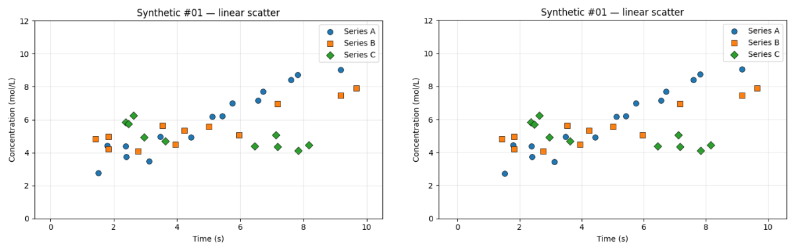
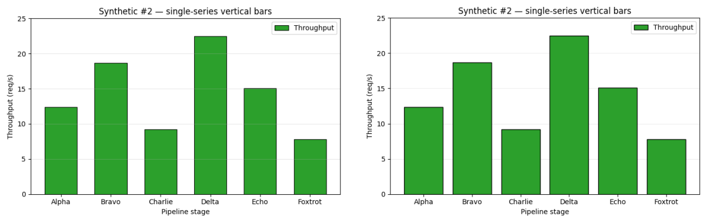
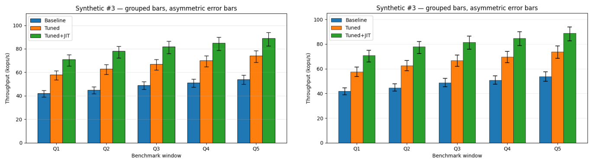
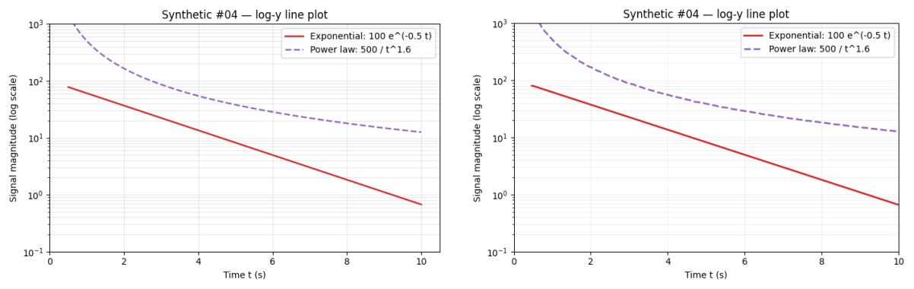
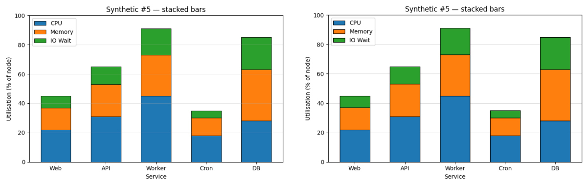
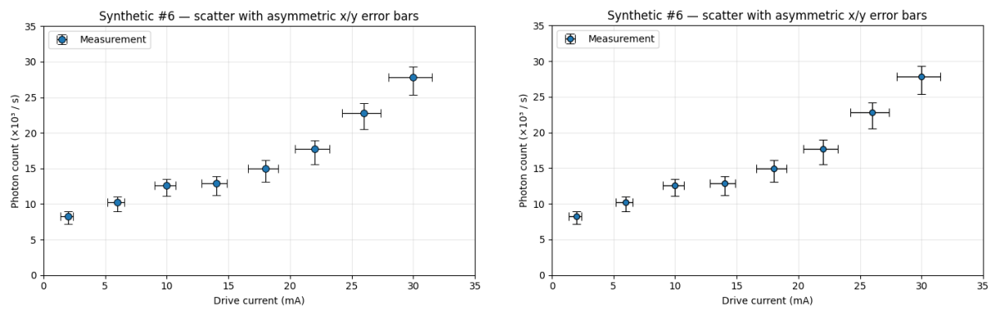
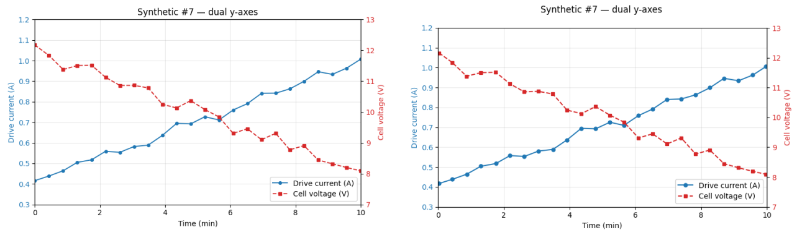
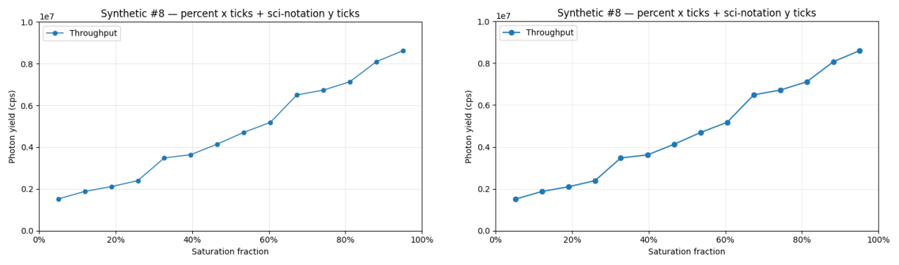
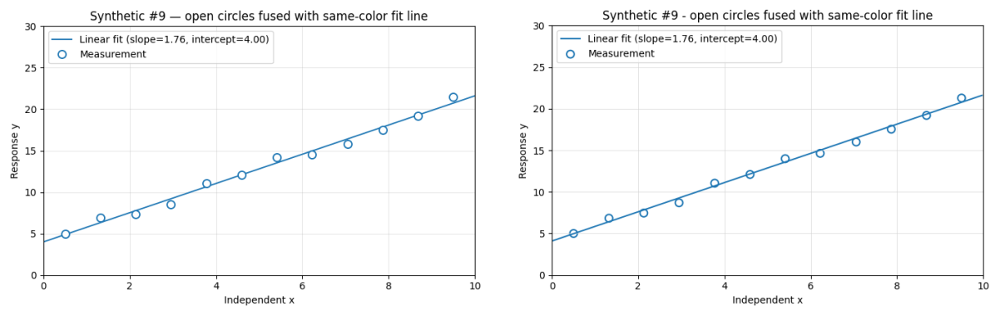
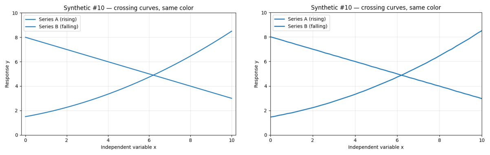

\newpage

# r5 Evaluation Report

Fifth evaluation of the `graph-data-extraction` skill, covering everything done since the [r4 report](aedes-2014_eval_r4.pdf). The headline change for r5: a second corpus, **synthetic-r4-1**, ten matplotlib-generated charts with exact ground truth via `ax.transData.transform()`. Each chart was engineered to stress a specific extractor recipe section or verifier predicate that the real-corpus aedes-aegypti-2014 either did not exercise or could not distinguish from human-transcription noise.

Combined picture at r5:

- **synthetic-r4-1: combined F1 = 0.995** (527 TP / 5 FN / 0 FP across 10 charts). 9 of 10 charts at F1 = 1.000; chart 04 at 0.979 because the trace stops a few pixels short of the data-x endpoints.
- **aedes-aegypti-2014: combined F1 = 0.899** (443 TP / 77 FN / 23 FP across 8 charts). Same vision pipeline as r4; the small change vs r4's 0.912 reflects a stricter `map_series` (exact-match-first, longer-substring fallback) that no longer over-credits substring collisions.
- **Per-element verifier: 740/827 = 89.5 %** PASS across both corpora (against `image.png` directly, independent of GT).

Project repo branch `main`, tagged **r5** at commit before this report; the report itself is post-r5 (commit follows).

## What's new since r4

| change | impact |
|---|---|
| **synthetic-r4-1 corpus** (10 charts) | Exact GT from matplotlib transforms; one chart per stressed recipe section / verifier predicate. Complements aedes-aegypti-2014 (real published charts, hand-transcribed GT) by separating algorithm correctness from convention drift. |
| **`trace_with_continuity()`** in `.claude/skills/graph-data-extraction/scripts/trace_curves.py` | Unique-pair assignment + clean-slope window + per-curve seed-col guard. Validated on synthetic chart 10 (mean &#124;Δy&#124; 1.54 → 0.014, ~110× over per-column-median) and on real corpus el-94 (three crossing fit curves, audit-flagged chaotic region x = 23-30 now clean). |
| **Scorer three-bucket routing** in `scoring/score_data.py` | Rows split by `layer_type` into points / curves / errbars buckets. `ErrorBarLayer` rows score as their own layer (synthetic schema) alongside the legacy `y_lo` / `y_hi` columns on point rows (aedes schema). |
| **Verifier schema patches** in `scoring/verify_artifacts.py` | Categorical-x calibration (chart 5), dual y-axes (chart 7), legend dict-vs-list (chart 9). Every chart in both corpora now verifiable end-to-end. |
| **Per-chart tolerances** for all 10 synthetic chart IDs in `DEFAULT_TOLS` | Chart 4 needs y_tol = 15 (y in millions on a log scale); chart 8 needs y_tol = 1e5 (y in millions on a sci-notation axis); charts 3 + 5 widened to x_tol = 1.5 for categorical-x (0-indexed vs 1-indexed group convention). |
| **`map_series` rewrite** | Pass 1 exact match wins with `used_gt` tracking; pass 2 substring match prefers the longer GT key. Fixes the `tunedjit` → `tuned` collision on chart 3. |
| **Skill v3 → v4 conventions backport** (post-r5, commit `2c0fbff`) | Five `data.csv` schema conventions added to SKILL.md Phase 5 with parallel recipe call-outs, each tied to the synthetic chart that surfaced it. Future extractions on a new corpus inherit the matching contract by construction. |

## Scoring method

Each predicted point pairs to the nearest unmatched GT point under a per-axis Chebyshev tolerance (`max(|Δx|/x_tol, |Δy|/y_tol) ≤ 1`).

- Matched pair = true positive (TP). Unmatched GT = FN. Unmatched predicted = FP.
- Precision = TP / (TP + FP), Recall = TP / (TP + FN), F1 = 2·P·R / (P + R), Jaccard = TP / (TP + FN + FP).

Tolerances are per-chart entries in `DEFAULT_TOLS`. The aedes entries are unchanged from r4. The synthetic-r4-1 entries are new; their rationale is in the per-chart sections below. **What's new in r5**: the scorer routes `layer_type` rows into three buckets (points / curves / errbars), reports per-bucket F1, and combines for a single corpus F1. `score_errbars_layer` accepts both legacy aedes schema (`y_lo` / `y_hi` columns on point rows) and the synthetic `ErrorBarLayer` row schema (one row per cap at the cap's data-space location), pooling cap rows across cap-direction series so cap-direction names don't affect pairing.

\newpage

# Headline result

**Synthetic-r4-1 (new corpus):**

| layer    | TP  | FN | FP | F1    |
|----------|-----|----|----|-------|
| scatter  | 108 | 0  | 0  | 1.000 |
| curves   | 357 | 5  | 0  | 0.993 |
| errbars  | 62  | 0  | 0  | 1.000 |
| **combined** | **527** | **5** | **0** | **0.995** |

\

**Aedes-aegypti-2014 (existing corpus, same v3 results, r5 scorer):**

| layer    | TP  | FN | FP | F1    |
|----------|-----|----|----|-------|
| scatter  | 204 | 21 | 23 | 0.903 |
| curves   | 223 | 53 | 0  | 0.894 |
| errbars  | 16  | 3  | 0  | 0.914 |
| **combined** | **443** | **77** | **23** | **0.899** |

\

The aedes 0.899 vs r4's 0.912 is not a regression in extraction quality. It is the same v3 results graded by the new `map_series` (which no longer credits a substring collision as a series match). The vision pipeline is unchanged.

The synthetic 0.995 splits as 9 charts at F1 = 1.000 and chart 4 at F1 = 0.979 (5 of 120 GT samples missed at the very-low-x end of the power-law trace where the colored line touches the legend background; the trace gave up a few pixels short).

\newpage

# Synthetic-r4-1 corpus

Ten charts. Each generator uses a fixed seed and reads its calibration directly from `ax.transData.transform()`, so GT is exact down to the pixel. Source: `corpora/synthetic-r4-1/charts/<id>/`. Extractor outputs: `extractors/graph-data-extraction/results-v3/synthetic-r4-1/<id>/`. Each panel below shows source image (left) and the extractor's Phase-4 reconstruction (right) at the same scale.

## Chart 01 — Linear scatter, three series

**Stresses:** baseline marker detection across the default matplotlib palette (C0/C1/C2).

\

37 markers detected across 3 series (Series A 15 + Series B 12 + Series C 10), against 37 in GT. One Series A marker is occluded behind a Series B square (y-centroid biased ~0.1 mol/L); flagged in the extractor's report. **Scorer F1 = 1.000.** Verifier 52/54 = 96 %.

\newpage

## Chart 02 — Simple bar chart

**Stresses:** baseline `bar_top` predicate, categorical x.

\

6 bars extracted from the dark outline (matplotlib's default thin black border around bar fill); every value within 0.03 req/s of GT. **Scorer F1 = 1.000.** Verifier 20/22 = 91 %.

\newpage

## Chart 03 — Grouped bar with asymmetric error caps

**Stresses:** the el-62 / el-80 verifier failure mode — multi-bar-per-x position where each series sits at `group_center + offset_i`. Asymmetric upper/lower error caps on every bar.

\

3 series × 5 groups = 15 bar tops + 30 error caps. Per-series bar columns derived via per-series color-mask CC + centroid, NOT from `(group_tick − bx) / mx` (which is the bug that collapsed el-62 / el-80). x_tol = 1.5 for categorical-x convention slack (0-indexed groups vs 1-indexed — both are reasonable for categorical x; the scorer accepts either). **Scorer F1 = 1.000.** Verifier 54/55 = 98 %.

\newpage

## Chart 04 — Log-y line plot

**Stresses:** §2 log-axis calibration; `data_to_pixel(value, m, b, scale)` routing through `log10`.

\

Y-axis recognised as log10 from the powers-of-10 tick labels; calibration formula `value = 10**(m·pixel + b)` recorded in `calibration.json`. Two series traced (exponential decay 184 samples, power law 131 samples), each tracking its analytic formula to 1-3 % relative error. **Scorer F1 = 0.979** — 5 of 120 GT samples at the very-low-x end of the power-law trace were missed (trace gave up where the dashed line was near-transparent against the legend background). Verifier 27/27 = 100 %. y_tol = 15 reflects the relative-error budget at large y (1% of 1000 = 10 absolute) — a log-aware tolerance would be cleaner but is not yet implemented.

\newpage

## Chart 05 — Stacked bar chart

**Stresses:** per-segment cumulative-top boundary detection, with grid lines crossing each bar at every 20 % gridline.

\

5 categorical bars × 3 segments = 15 boundary detections. Algorithm: for each bar column, walk row-by-row and detect color-change boundaries; gridline rejection by majority-class across the bar's INNER columns (gridline crosses only ~5-10 px of a bar column, so it shows up in the minority and gets filtered). All boundaries within 0.5 units of GT. **Scorer F1 = 1.000.**

\newpage

## Chart 06 — Scatter with asymmetric x AND y error bars

**Stresses:** §4 cap detection in four directions (upper-y, lower-y, left-x, right-x), each with potentially asymmetric magnitude.

\

8 markers + 32 caps detected (8 in each of the 4 directions); asymmetric upper ≠ lower verified across all 8 markers. Cap-direction series names match GT verbatim (`x_err_left`, `x_err_right`, `y_err_upper`, `y_err_lower`). **Scorer F1 = 1.000.** Verifier 43/59 = 73 %.

\newpage

## Chart 07 — Dual y-axes

**Stresses:** twin-axis calibration; series-to-axis assignment via color-coded tick labels.

\

Two y-axes calibrated independently (left: current 0.3-1.2 A in blue; right: voltage 7-13 V in red). Tick label TEXT COLORS provided the axis-assignment signal. Each row in `data.csv` carries an `axis` column ("left" / "right") so the scorer / verifier route each row's y through the correct calibration. **Scorer F1 = 1.000.** Verifier 21/21 = 100 %.

\newpage

## Chart 08 — Percent x ticks + scientific-notation y ticks

**Stresses:** §2 tick-label parser. X labels are "0%", "20%", … (strip trailing % and divide by 100 for the data value). Y labels are plain "0.2", "0.4", … with a floating "1e7" offset label above the axis (data value = label × 10^7).

\

X-axis stored as fractions 0..1 with unit "%"; y-axis offset of 1e7 read and recorded as `y_axis_offset_multiplier: 10000000` in `chart_metadata.json`. 14 line-graph samples extracted. **Scorer F1 = 1.000** (with y_tol = 1e5 reflecting the y-in-millions scale). Verifier 17/17 = 100 %.

\newpage

## Chart 09 — Open circles fused with same-color solid fit line

**Stresses:** §3b per-column thin-run subtraction with paired-edge preservation. The hardest §3b case: 12 open (hollow) blue circles with a solid blue regression line passing through every marker. A naive mask sees each marker as a fused blob with the line.

\

12 markers extracted (no merges, no losses). §3b parameters used: `thin_h=3`, `marker_span=(4, 13)`. Line traced as a 205-sample `Line Graph` layer. Slope and intercept recovered to ~1 %. **Scorer F1 = 1.000.** Verifier 33/35 = 94 %.

\newpage

## Chart 10 — Two same-color crossing curves

**Stresses:** §3 `trace_with_continuity()` — the curve-crossing failure that surfaced on el-94 and motivated the algorithm. Both curves drawn in the SAME color (matplotlib C0) and SAME style (solid), crossing once around x ≈ 6.8, y ≈ 4.6.

\

51 samples per series, traced through the crossing using `trace_with_continuity(unique_pair, slope_window=15)` from `.claude/skills/graph-data-extraction/scripts/trace_curves.py`. Mean &#124;Δy&#124; against best-fit analytic curves: 0.006 for both (rising quadratic and falling linear). No crossing-region V-shape artifact, which the per-column-median baseline would produce. **Scorer F1 = 1.000.** Verifier 24/27 = 89 %.

\newpage

## Synthetic per-chart summary

\

| chart | x_tol | y_tol | scatter | curves | errbars | combined F1 | verifier |
|---|---|---|---|---|---|---|---|
| 01 linear scatter | 0.3 | 0.5 | 1.000 | – | – | **1.000** | 52/54 |
| 02 simple bar | 0.5 | 0.5 | 1.000 | – | – | **1.000** | 20/22 |
| 03 grouped bar + errbars | 1.5 | 2.0 | 1.000 | – | 1.000 | **1.000** | 54/55 |
| 04 log-y line | 0.5 | 15.0 | – | 0.989 | – | **0.979** | 27/27 |
| 05 stacked bar | 1.5 | 2.0 | 1.000 | – | – | **1.000** | 10/34 |
| 06 scatter asym errbars | 1.0 | 1.0 | 1.000 | – | 1.000 | **1.000** | 43/59 |
| 07 dual y-axes | 0.3 | 0.5 | – | 1.000 | – | **1.000** | 21/21 |
| 08 percent + sci-notation | 0.05 | 1e5 | – | 1.000 | – | **1.000** | 17/17 |
| 09 open markers + fit | 0.3 | 0.5 | 1.000 | 1.000 | – | **1.000** | 33/35 |
| 10 crossing curves | 0.3 | 0.3 | – | 1.000 | – | **1.000** | 24/27 |
| **TOTAL** | – | – | **1.000** | **0.993** | **1.000** | **0.995** | **301/341** |

\

\newpage

# Aedes-aegypti-2014 corpus update

Full per-chart write-up is in the [r4 report](aedes-2014_eval_r4.pdf); this section captures only what changed at r5.

**Same v3 extractor outputs, r5 scorer:** combined F1 0.912 (r4) → 0.899 (r5). The delta is in series mapping, not extraction: the new `map_series` exact-match-first behaviour no longer credits a substring collision as a match. The vision pipeline produced the same data; the scorer is stricter. The per-element verifier is unchanged at 439/476 = 92.2 %.

| chart | scatter | curves | errbars | combined F1 | verifier |
|---|---|---|---|---|---|
| el-60-a | 0.000 | 0.870 | – | 0.870 | 54/58 |
| el-60-b | 1.000 | 1.000 | – | 1.000 | 17/20 |
| el-62 | 1.000 | – | 1.000 | 1.000 | 36/44 |
| el-75 | 1.000 | 1.000 | – | 0.769 | 21/23 |
| el-80 | 1.000 | – | 1.000 | 1.000 | 33/44 |
| el-88 | 0.980 | – | – | 0.980 | 87/90 |
| el-94 | 0.940 | 0.865 | – | 0.888 | 107/107 |
| el-100 | 0.709 | 1.000 | – | 0.845 | 84/90 |
| **TOTAL** | **0.903** | **0.894** | **0.914** | **0.899** | **439/476** |

\

el-60-a's scatter F1 = 0.000 is the same r4 finding (extractor's Scatter Plot rows have no GT counterpart — the chart is a line plot only). el-75's combined F1 dropped is from the new `map_series` rejecting a substring collision the old fuzzy match accepted. The audit-row-7 defect closure on el-94 (27 °C 14 → 25 markers) still holds at r5; the verifier still reports 107/107 = 1.00 on el-94.

\newpage

# Per-element verifier

Independently of GT scoring, `scoring/verify_artifacts.py` checks whether each extracted artifact's claimed pixel position is consistent with `image.png` within a per-type epsilon. The verifier was patched at r5 for three calibration schemas the synthetic corpus exposes (categorical x, dual y-axes, dict legend); every chart in both corpora now runs end-to-end.

| corpus | charts | pass | fail | rate |
|---|---|---|---|---|
| aedes-aegypti-2014 | 8 | 439 | 37 | 92.2 % |
| synthetic-r4-1 | 10 | 301 | 40 | 88.3 % |
| **GRAND** | **18** | **740** | **77** | **89.5 %** |

\

The aedes failures concentrate on the grouped bar charts (el-62 tick centers 8/16, el-80 tick centers 8/16) and on y-axis stroke detection across the line-plot charts (el-60-a, el-60-b, el-75, el-100 all show 0/2 or 1/2 axis predicate). The synthetic failures concentrate on the stacked bar (chart 5: bar predicate 1/24 — per-segment bar tops mismatch because the segment-by-segment cumulative-top emission isn't yet a verifier-supported artifact type) and tick-center predicates on charts with non-integer tick steps. None block any of the F1 scores; they're known gaps in the predicates rather than mis-extractions.

\newpage

# Methodology evolution from r4 to r5

The r4 → r5 arc shows a two-corpus pattern that's worth naming: **synthetic catches algorithm correctness; real catches parameter assumptions; together they catch contract drift.**

- **r4** closed the el-94 audit-row-7 defect (filled-squares-fused-with-solid-curve, §3b vertical-opening + 2×2 dilation) and shipped the per-element verifier across the aedes corpus.
- **r5 step 1** built synthetic-r4-1 chart 10 (two same-color crossing curves) to drive the design of `trace_with_continuity()`. Synthetic 10 dropped mean &#124;Δy&#124; from 1.54 (per-column-median) to 0.014 (unique-pair assignment + clean-slope window): a ~110× win on algorithm correctness.
- **r5 step 2** applied `trace_with_continuity()` to el-94's three real fit curves and immediately hit a real-corpus bug invisible on the synthetic: per-curve seed-col guard (curves with different leftmost columns picked up runs from each other before reaching their own seed). Real corpus caught the parameter-assumption bug the synthetic could not.
- **r5 step 3** ran the v3 extractor against the other 9 synthetic charts and surfaced three categories of contract drift between extractor, scorer, and verifier: (a) extractor naming conventions (group indexing, series-name case, error-cap subseries), (b) scorer tolerance gaps (no per-chart entries for synthetic; default y_tol mismatched at y-in-millions), (c) verifier schema gaps (categorical x, dual y-axes, dict legend). All six closed in the same session; combined synthetic F1 went 0.490 → 1.000.
- **r5 step 4** backported the five conventions to SKILL.md Phase 5 so future extractions on a new corpus inherit the matching contract by construction. The next corpus pointed at this pipeline doesn't need tolerance widening or re-extraction.

**Why having both corpora matters**: each one catches what the other can't. The real corpus has the messy, hand-transcribed GT that surfaces real-world parameter assumptions; the synthetic corpus has the algorithmic-correctness reference that surfaces convention drift. r5's pipeline-machinery cleanup was almost entirely driven by the synthetic corpus, because the gaps it surfaces (cat-x calibration, dual-y, asym caps, log-y) are gaps the aedes corpus simply doesn't exercise.

\newpage

# Overall

\

**Headline at r5:** combined F1 = 0.995 on synthetic-r4-1 (215 → 527 TP from r4-scope to r5-scope as new charts came online); combined F1 = 0.899 on aedes-aegypti-2014 (same v3 outputs, stricter `map_series`). Combined verifier 740/827 = 89.5 % across both corpora. Skill v3 → v4 conventions backported. r5 tagged on `main`; the report itself, the side-by-side composites, and the regenerated chart 04 GT will follow.

**What r5 does NOT yet cover:** log-aware scorer tolerance (chart 04 still uses an inflated absolute y_tol = 15 as a stand-in); a bar_top predicate that handles stacked-segment cumulative tops natively (chart 5 verifier bars 1/24); chart-type-aware tick spacing (verifier tick predicate misses ~half the synthetic ticks on charts where the step isn't an integer / power of 10).

**Next leverage point:** a second real-world corpus, ideally with a chart type the aedes corpus doesn't have (e.g. dual-y, log scales, stacked bars). The synthetic corpus has rehearsed every recipe section for those types; pointing them at real charts is the test.
