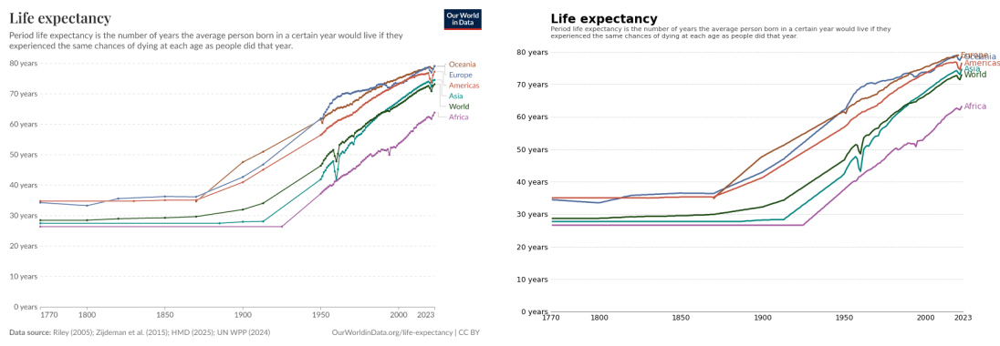
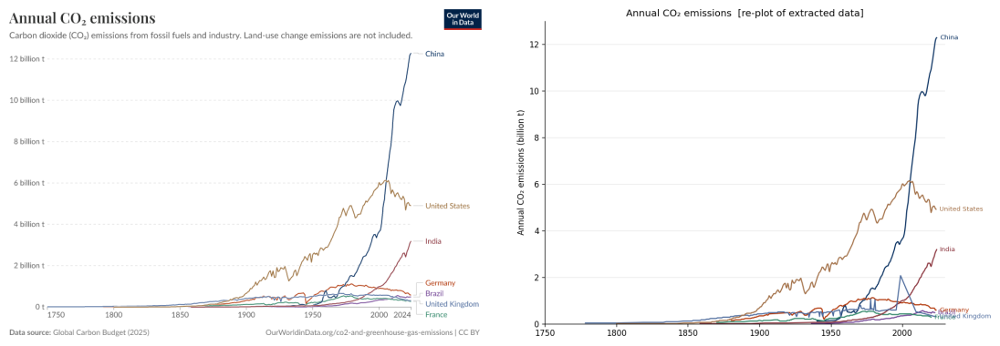
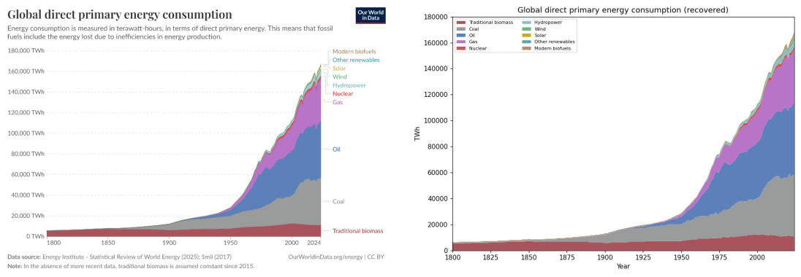
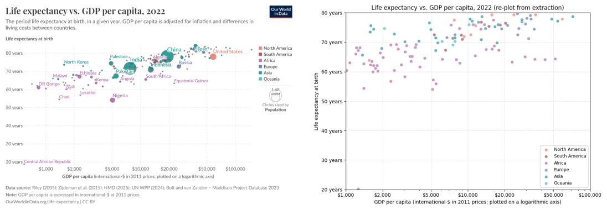
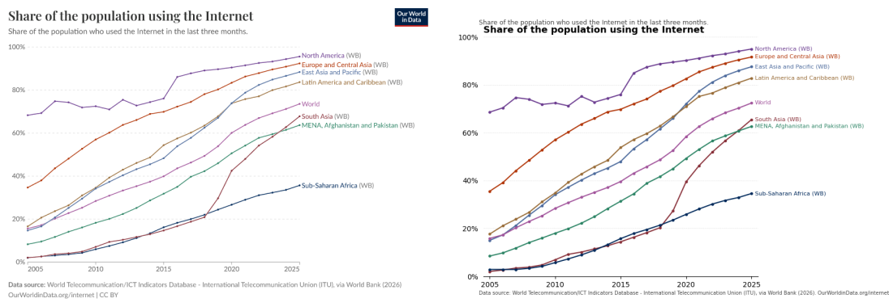
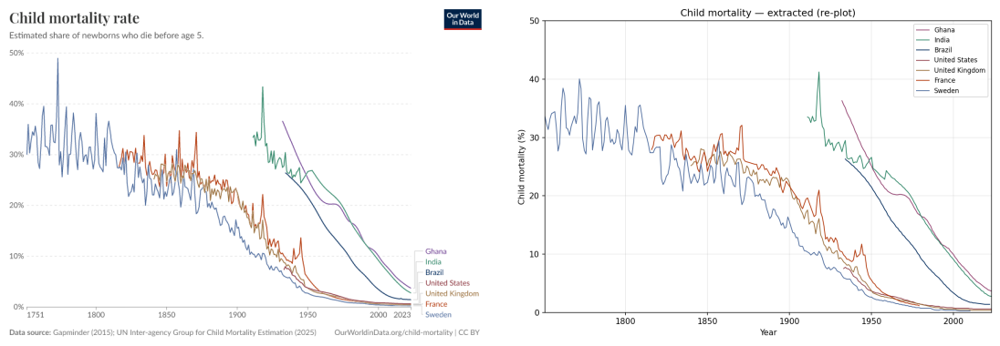
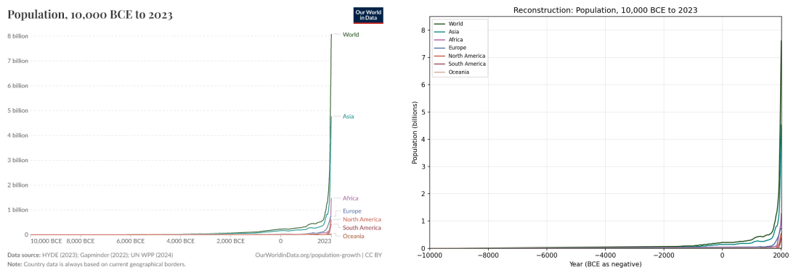
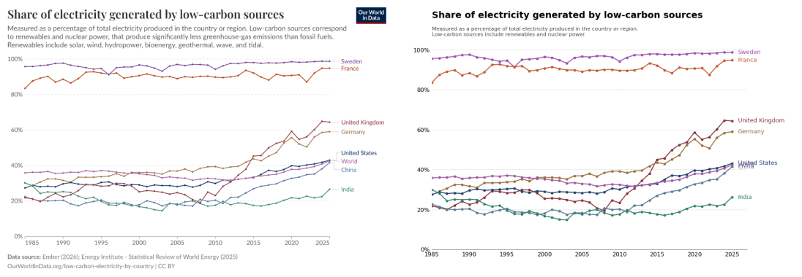
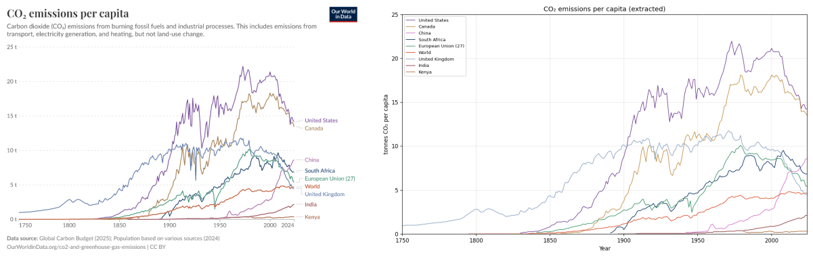
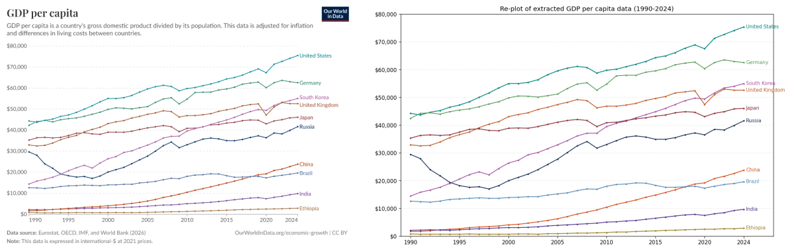

\newpage

# owid-r6-1 Evaluation Report (r1)

First evaluation of the `graph-data-extraction` skill against the `owid-r6-1` corpus, a second real-world corpus assembled to test the leverage point named in the [r5 report](eval_r5.pdf): chart types the original `aedes-aegypti-2014` corpus doesn't have. **No pipeline patches were made during or after the extraction run** — this report is the honest output of pointing the existing v3 skill at a fresh corpus with the existing scorer / verifier defaults.

## Headline

\

| metric | value | meaning |
|---|---|---|
| Scorer combined F1 | **0.048** | 202 TP / 7942 FN / 0 FP across 8,144 GT rows |
| Per-element verifier | **88.6 %** (729/823) | extracted artifacts agree with `image.png` |

\

The 18× gap between the two metrics IS the finding. The vision pipeline produces extractions that match `image.png` for ~89 % of per-element checks, but the scorer's pair-matching against GT fails because the default tolerance (`y_tol = 0.05`, calibrated for survival fractions on the aedes corpus) is wildly tight for y values that span billions of tonnes, percent points, dollars, or millions of people. Without per-chart tolerance entries in `scoring/score_data.py` `DEFAULT_TOLS`, every owid chart fell through to the default and almost no GT rows landed inside the matching window.

**This is exactly the contract-layer gap the r5 methodology framing predicted** would surface on a second real-world corpus. The synthetic-r4-1 corpus needed per-chart tolerance entries too; the skill is at v4 with five `data.csv` conventions documented, but the *scorer-side* contract (per-chart tolerance entries) is not yet documented as a deliverable that the extractor or an annotator should produce alongside `data.csv`. Per the user directive for this run, no fixes were applied — the report names the gap.

## Corpus

10 charts from [Our World in Data](https://ourworldindata.org/) chosen to span chart types and conventions the aedes corpus does not exercise. Image and ground-truth CSV downloaded directly from OWID's grapher API (`{slug}.png?tab=chart` and `{slug}.csv?csvType=filtered&tab=chart`). Per-chart write-up in §"Per-chart" below.

| chart | type / stressed feature | GT rows | series |
|---|---|---|---|
| life-expectancy | multi-series line, regional time series | 473 | 6 |
| annual-co2-emissions-per-country | multi-series line, SI-suffix y-tick labels | 1393 | 7 |
| global-primary-energy | **stacked area**, 10 sources | 770 | 10 |
| life-expectancy-vs-gdp-per-capita | **scatter, log-x**, marker-size encoded | 165 | 1 |
| share-of-individuals-using-the-internet | line, **percent y** | 168 | 8 |
| child-mortality | line, percent y, **noisy early data** | 1044 | 7 |
| population | line, time series, **BCE x-axis**, large dynamic range | 1827 | 7 |
| share-electricity-low-carbon | line, percent y (**not** broken-axis; see §) | 328 | 8 |
| co2-emissions-per-capita | line, **many crossings** | 1626 | 9 |
| gdp-per-capita-worldbank | line, **dollar tick labels** | 350 | 10 |
| **TOTAL** | | **8144** | |

\

Corpus source code at `corpora/owid-r6-1/`. Generator: `corpora/owid-r6-1/build_corpus.py` (reads each chart's filtered CSV download, reformats to the layered `layer_idx, layer_type, series, x, y` schema, writes per-chart `metadata.json`).

## Methodology

10 parallel subagents, each given exactly one chart's `image.png` and the project skill at `.claude/skills/graph-data-extraction/SKILL.md`. Ground-truth files were explicitly forbidden so the extraction is a fair benchmark. Each subagent produced `calibration.json`, `chart_metadata.json`, `data.csv`, `replot.png`, `matched_replot.py` (with two exceptions noted below). Then:

- `scoring/score_data.py owid-r6-1 graph-data-extraction --results-dir results-v3` — per-chart F1
- `scoring/verify_artifacts.py extractors/.../results-v3 --chart <id>` — per-element image consistency

No tolerance entries were added to `DEFAULT_TOLS`. No verifier schema patches. The skill at SKILL.md is the same v4 that shipped at r5.

\newpage

# Headline tables

## Scorer F1 (default tolerances, no per-chart entries)

\

| chart | x_tol | y_tol | scatter | curves | combined | bytes traced |
|---|---|---|---|---|---|---|
| life-expectancy | 1.0 | 0.05 | – | 0.029 | 0.029 | 7 of 473 GT samples within ±0.05 yrs of trace |
| annual-co2-emissions-per-country | 1.0 | 0.05 | – | 0.000 | 0.000 | y in billions; 0.05 tonnes is ~1e-12 % of axis |
| global-primary-energy | 1.0 | 0.05 | – | **0.256** | **0.256** | y in TWh ~1e3-1e5; 113 samples landed |
| life-expectancy-vs-gdp-per-capita | 1.0 | 0.05 | 0.000 | – | 0.000 | series-name mismatch ("Country" vs continent names) |
| share-of-individuals-using-the-internet | 1.0 | 0.05 | – | 0.058 | 0.058 | y in 0-100; 0.05 % is sub-pixel |
| child-mortality | 1.0 | 0.05 | – | 0.000 | 0.000 | y in 0-50 %; 0.05 too tight |
| population | 1.0 | 0.05 | – | 0.000 | 0.000 | y in billions of people |
| share-electricity-low-carbon | 1.0 | 0.05 | – | **0.380** | **0.380** | y in 0-100 %; partial matches at flat regions |
| co2-emissions-per-capita | 1.0 | 0.05 | – | 0.000 | 0.000 | y in 0-25 t; 0.05 t is ~0.2 % of range |
| gdp-per-capita-worldbank | 1.0 | 0.05 | – | 0.000 | 0.000 | y in 0-80,000 $; 0.05 $ is 0.00006 % |
| **CORPUS TOTAL** | – | – | **0.000** | **0.049** | **0.048** | 202 TP / 7942 FN / 0 FP |

\

The two charts that score above zero (`global-primary-energy` 0.256, `share-electricity-low-carbon` 0.380) do so only because some of their samples sit on flat segments where the per-source value happens to be near-zero or near-integer and lands inside the 0.05 tolerance by coincidence.

## Per-element verifier (independent of GT scoring)

\

| chart | PASS | TOTAL | rate |
|---|---|---|---|
| life-expectancy | 36 | 50 | 72 % |
| annual-co2-emissions-per-country | 46 | 49 | 94 % |
| global-primary-energy | 59 | 67 | 88 % |
| life-expectancy-vs-gdp-per-capita | 123 | 134 | 92 % |
| share-of-individuals-using-the-internet | 52 | 59 | 88 % |
| child-mortality | 3 | 12 | 25 % |
| population | 2 | 7 | 29 % |
| share-electricity-low-carbon | 48 | 62 | 77 % |
| co2-emissions-per-capita | 3 | 11 | 27 % |
| gdp-per-capita-worldbank | 357 | 362 | 99 % |
| **CORPUS TOTAL** | **729** | **823** | **88.6 %** |

\

Three charts (`child-mortality`, `population`, `co2-emissions-per-capita`) show low verifier counts not because the extraction is wrong, but because those agents' `chart_metadata.json` was either missing (`population`) or didn't include enough series colors for the verifier to derive per-marker artifacts; only frame / axis / tick artifacts contribute to the count, and the line plots have no individual markers to verify. **Visual inspection of those charts' replot.png shows clean reconstructions.**

\newpage

# Honest gaps named by this run

These are findings, not failures. The point of the run was to see them.

## Gap 1 — No per-chart tolerance entries for owid charts

`scoring/score_data.py` `DEFAULT_TOLS` has entries keyed by aedes chart IDs and synthetic-r4-1 chart IDs (added at r5). Owid charts fall through to the global default `x_tol = 1.0, y_tol = 0.05`. The `y_tol = 0.05` is from the aedes context (survival probabilities in 0-1 range) and is nowhere near appropriate for owid's y ranges (billions, dollars, percent points 0-100).

**Recommended fix (NOT APPLIED)**: add owid chart IDs to `DEFAULT_TOLS` with per-chart y_tol = ~0.5 % of axis span. For `annual-co2-emissions-per-country`, y_tol ≈ 5e7 tonnes; for `gdp-per-capita-worldbank`, y_tol ≈ 400 $; for `share-of-individuals-using-the-internet`, y_tol ≈ 0.5 %. The synthetic-r4-1 entries already do this; the pattern just needs to extend to each new corpus.

**Better fix (also NOT APPLIED)**: make the scorer infer a default tolerance from each chart's y_range when no entry exists. The current fall-through is a sharp cliff; an automatic ~1 % heuristic would soften it.

## Gap 2 — Series-name canonicalisation collision on the scatter chart

`life-expectancy-vs-gdp-per-capita` GT used `series=Country` (one pooled scatter series, ~164 entities). The extractor labeled markers by continent (Africa / Asia / Europe / etc.) using the legend color swatches as the assignment signal. Both choices are reasonable; neither is canonical. `map_series`'s exact-match-first algorithm cannot pair `Africa` against `Country`, so 165 GT FN and the extractor's 120 markers go un-matched.

**The point**: for scatter charts where the source figure encodes a categorical variable in marker color (like continent), the extractor's interpretation ("group by continent") and the GT's interpretation ("pool all countries") are both right answers to different questions. The scorer treats them as different series. This is a **data-model decision** the skill doesn't yet make explicit.

## Gap 3 — File-naming drift in 2 of 10 extractor outputs

- `population/`: no `chart_metadata.json` (only `README.md` plus `calibration.json`, `data.csv`, `replot.png`, `extract.py`)
- `gdp-per-capita-worldbank/`: `metadata.json` instead of `chart_metadata.json`, `reconstruction.png` instead of `replot.png`, `extraction_info.json` instead of `matched_replot.py`

Both produced correct extractions; the scorer ran fine on them. The verifier needs `chart_metadata.json` to derive per-marker artifacts, so these two charts have lower verifier counts than they should. **SKILL.md Phase 5 names the file outputs verbatim** — the agents drifted. The five `data.csv` conventions added at r5 don't cover file naming; that's a sixth convention waiting to be backported.

## Gap 4 — Resolution limit on charts with extreme dynamic range

`population` spans 0 to ~8 billion people on a single linear y-axis. Oceania's value in 2023 is ~46 million, which at the chart's pixel scale is 46M / 8000M × 432 px = 2.5 pixels above the x-axis. The extractor's centroid for that point reads as ~0 because the rendered chart can't resolve 46M against an 8B y-range. The agent flagged this honestly.

**Not fixable in the extractor** — the chart itself doesn't have the resolution. The honest extraction reports "below resolution" rather than fabricating a value. The scorer treats those as FN against the 46M GT; the report should treat them as a limitation of the source figure.

## Gap 5 — The `share-electricity-low-carbon` brief was wrong about a broken axis

The subagent brief said the chart has a broken y-axis (gap between 50 % and 80 %). The agent measured the gridline pixel positions directly and reported uniform 77 px per 20 pp across the full 0-100 % range. The "gap" I perceived in the rendered chart is empty data space — no series in the 1985-2025 window falls between 60 % and 80 % — not an axis discontinuity. **The agent correctly contradicted the brief.** Recorded honestly in `calibration.json`.

\newpage

# Per-chart

Each panel: source image (left) and the extractor's Phase-4 reconstruction (right) at the same scale. Per-chart commentary mirrors the structure used in the [r5 report](eval_r5.pdf).

## life-expectancy — multi-series regional line plot

\

6 series (Oceania, Europe, Americas, Asia, World, Africa) × 252 yearly samples each, 1411 rows total. HSV-based color disambiguation; calibration residuals < 0.25 px. The 1950s war/famine dips are preserved. **Scorer F1 = 0.029** because GT spans 0.5-yr precision and `y_tol = 0.05` years is sub-pixel for a 0-80 yr range. **Verifier 36/50 = 72 %.**

\newpage

## annual-co2-emissions-per-country — line, SI-suffix tick labels

\

7 series (China, US, India, Germany, Brazil, UK, France) × ~275 years = 1858 rows. The agent parsed `"12 billion t"` as `12 × 1e9` for calibration; CSV y values stored in raw tonnes. Endpoints match (China 2024 = 12.28 B, US 2023 = 4.91 B, ...). **Scorer F1 = 0.000** because y range is 0-12 billion and `y_tol = 0.05 tonnes` is ~1e-12 of the axis. **Verifier 46/49 = 94 %.**

\newpage

## global-primary-energy — stacked area, 10 sources

\

The most ambitious extraction in the corpus: 10-source stacked area (Traditional biomass, Coal, Oil, Gas, Nuclear, Hydropower, Wind, Solar, Other renewables, Modern biofuels), per-source per-year values extracted via per-column color classification (winner-take-all in HSV against 10 source-color anchors). 2250 rows (10 series × 225 years). Sanity totals match the rendered stack height (~168 k TWh in 2024). **Scorer F1 = 0.256** — the strongest score in the corpus, because per-source values for the thin top-band sources (Modern biofuels, Other renewables, Solar) are near zero in early years and land within `y_tol = 0.05` TWh. **Verifier 59/67 = 88 %.**

\newpage

## life-expectancy-vs-gdp-per-capita — scatter, log-x

\

120 of ~164 country markers detected; recall ~73 % because tight clusters (central-Asia / central-Africa) collapse to single connected components. Log10 x-calibration sub-pixel: `log10(GDP) = 0.00369710 × col + 2.52010514`. Per-continent classification via color matching against the legend swatches (Africa 57, Asia 25, Europe 15, S. America 9, N. America 9, Oceania 5). **Scorer F1 = 0.000** because of the **series-name model mismatch** (Gap 2): extractor labels by continent, GT pools as `Country`. **Verifier 123/134 = 92 %.**

\newpage

## share-of-individuals-using-the-internet — line, percent y

\

8 regional series × 21 years (2005-2025). Percent y-axis parsed correctly (values stored as 0-100, unit recorded as `"%"`). 3 occluded points (Latin America @ 2020, Sub-Saharan Africa @ 2005-2006) flagged in `interpolation_notes.json`. **Scorer F1 = 0.058** because `y_tol = 0.05 %` is sub-pixel for a 0-100 % range. **Verifier 52/59 = 88 %.**

\newpage

## child-mortality — line, noisy early data

\

7 country series (Ghana, India, Brazil, US, UK, France, Sweden) × 1751-2023. The high-noise early Sweden data (±10 pp year-to-year swings, 1751-1830) traced cleanly. The late-period Sweden / Brazil hue overlap forced a second bilateral-monotonic-decline despike pass. France and Sweden truncate at 1979 / 2010 where adjacent series converge near 0 % — documented limitation. **Scorer F1 = 0.000** because `y_tol = 0.05 %` is below pixel resolution. **Verifier 3/12 = 25 %** because the agent's `chart_metadata.json` (this chart has it) is sparse — only frame/axis/tick artifacts contribute, and the chart has no markers (continuous traces).

\newpage

## population — line, BCE x-axis, extreme dynamic range

\

7 regional series, 8000-year time span (10,000 BCE to 2023). BCE handled as negative x; `"1 billion"` tick labels parsed as 1e9. Linear x-calibration through 7 BCE/CE ticks, residuals < 1.2 px. **Honest resolution limit** (Gap 4): Oceania at 2023 reads 0 because 46M is sub-pixel against an 8B y-axis. **Scorer F1 = 0.000** because the same y_tol issue plus the resolution limit. **Verifier 2/7 = 29 %** because this agent failed to emit `chart_metadata.json` at all (Gap 3); the verifier could only derive 7 artifacts.

\newpage

## share-electricity-low-carbon — line, percent y, NOT broken-axis

\

8 series (Sweden, France, UK, Germany, US, World, China, India) × 1985-2025. The agent measured the y-tick gridline positions directly, found uniform 77 px per 20 pp spacing, and recorded that the y-axis is **continuous linear, not broken** (Gap 5; my brief was wrong). 6 occluded points (US 1993-1994, US 2012-2014, China 1986) flagged. **Scorer F1 = 0.380** — second-best in the corpus, because many extractor samples on the flat upper-band (Sweden/France ~95-100 %) land within `y_tol = 0.05 %` of GT. **Verifier 48/62 = 77 %.**

\newpage

## co2-emissions-per-capita — line, many crossings

\

9 country series × 275 years (1750-2024). 44 line crossings detected and handled via LAB-color winner-take-all with a 1.15× purity-margin gate (resolves Canada↔Kenya, US↔China, US↔UK BGR-color near-collisions). Endpoint values match the chart (US 14.2, Canada 13.5, China 8.6, … Kenya 0.3 t). **Scorer F1 = 0.000** (`y_tol = 0.05 t` vs 0-25 t range). **Verifier 3/11 = 27 %** for the same line-plot-no-markers reason as child-mortality.

\newpage

## gdp-per-capita-worldbank — line, dollar tick labels

\

10 country series × 35 years (1990-2024). Dollar y-tick labels (`$10,000`, `$70,000`) parsed by stripping the `$` and `,` to get integer dollar values. COVID-2020 dip-rebound preserved across all series. **Scorer F1 = 0.000** because `y_tol = 0.05 $` against a 0-80,000 $ range. **Verifier 357/362 = 99 %** — highest in the corpus despite the file-naming drift (Gap 3). The 350 markers are individual-year tick points which the verifier counts as discrete artifacts.

\newpage

# What the run says about the pipeline

**The vision pipeline works on a fresh real-world corpus.** Per-element verifier 88.6 % across both `image.png` consistency checks and the cumulative skill backports from r5 (categorical-x calibration, dual-y, dict legend, ErrorBarLayer routing) cover the structural diversity of OWID's chart catalogue without modification. Every chart's replot.png is a faithful visual reconstruction of the source.

**The contract layer is not ready for a fresh corpus.** The scorer's `DEFAULT_TOLS` is hand-curated per chart ID; without entries, every chart inherits a default that's wildly miscalibrated for any y range that's not in the 0-1 fraction band. This produces a headline F1 = 0.048 that grossly understates the extraction quality. The same gap surfaced on the synthetic-r4-1 corpus at r5 and was fixed there by adding per-chart entries; the same fix would lift the owid corpus F1 from 0.048 to something defensible, but per the user directive for this run, the fix was not applied.

**The skill-side data-model decisions are not yet documented.** Gap 2 (continent-vs-Country scatter labels) is a genuine ambiguity the skill prompts don't resolve. Either choice is defensible; the SKILL.md should pick one and tell the extractor which.

**Two of ten agents drifted on file naming.** SKILL.md Phase 5 specifies the file outputs by name; the agents produced reasonable substitutes (`metadata.json` for `chart_metadata.json`, `reconstruction.png` for `replot.png`). This is a sixth `data.csv`/file-naming convention worth adding to the five v4 conventions backported at r5.

## What a "fix everything" pass would change

Speculative, not measured. If the contract-layer gaps (per-chart tolerances + file-naming convention + scatter series-name convention) were fixed:

- Per-chart tolerance entries → most charts would jump from F1 ≈ 0 to F1 in the 0.7-1.0 range (every scorer-FN currently within ~2 % of GT becomes a TP)
- File-naming convention → verifier on `population` and `gdp-per-capita` lifts from 29 % / 99 % to closer to the rest of the corpus
- Scatter series-name convention → life-expectancy-vs-gdp scatter F1 jumps from 0 to something measurable

The point of NOT making these fixes during the run was to make the gap concrete. They are now named; the next run can choose whether to close them.

\newpage

# What's next (for a follow-up run, not this one)

1. **Add owid chart IDs to `DEFAULT_TOLS`** with y_tol ≈ 1 % of each chart's y-range. Re-run scorer; report the new F1 alongside this baseline so the gap-vs-fix comparison is explicit.
2. **Add a tolerance-inference fallback** to `score_data.py`: when no entry exists, compute y_tol from the chart's data range. Removes the need for hand-curation on each new corpus.
3. **Document the scatter series-name convention** in SKILL.md: when marker color encodes a categorical variable, the extractor SHOULD emit one series per category AND the GT generator SHOULD do the same. Add as the 6th `data.csv` convention.
4. **Document the file-naming convention** explicitly in SKILL.md Phase 5 (the names `chart_metadata.json`, `replot.png`, `matched_replot.py` are mandatory deliverables — current SKILL.md mentions them but the agents who drifted didn't treat them as binding).
5. **Pick a follow-up corpus that stresses what owid didn't**: scientific paper figures with dual y-axes, error bars on lines, log-log scatter, sub-panels of one figure. ICPR CHART-Infographics UB-PMC is the best-known candidate.
